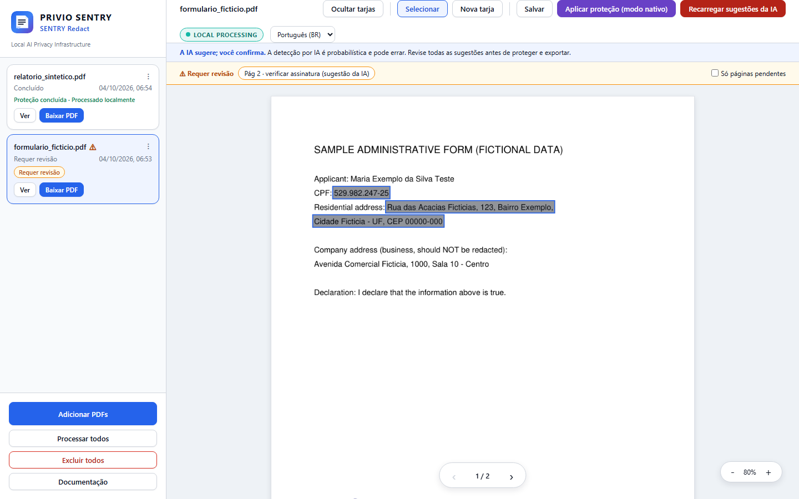

<p align="center">
  
</p>

<h1 align="center">Manual de uso: SENTRY Redact</h1>

<p align="center">
  <strong>PRIVIO SENTRY · tarja local de CPFs e endereços pessoais em PDFs, com revisão humana</strong><br>
  Tesseract OCR · detector YOLO de assinaturas · LLM de visão via Ollama · editor web (FastAPI)
</p>

<p align="center">
  <a href="#2-instalação-passo-a-passo"><strong>Instalar</strong></a> •
  <a href="#4-usando-a-aplicação-web"><strong>Usar</strong></a> •
  <a href="#10-solução-de-problemas"><strong>Solução de problemas</strong></a> •
  <a href="#11-perguntas-frequentes"><strong>Perguntas frequentes</strong></a> •
  <a href="../README.md"><strong>README</strong></a>
</p>

---

> [!IMPORTANT]
> **A IA sugere; você confirma.** O SENTRY Redact aponta detecções *potenciais* e prepara tarjas sugeridas.
> Ele **não garante anonimização**: toda saída deve ser revisada por uma pessoa antes de ser publicada ou
> compartilhada.

## Sumário

1. [Antes de começar](#1-antes-de-começar)
2. [Instalação passo a passo](#2-instalação-passo-a-passo)
3. [Configuração essencial](#3-configuração-essencial)
4. [Usando a aplicação web](#4-usando-a-aplicação-web)
5. [Painel gatekeeper](#5-painel-gatekeeper)
6. [Linha de comando (lote)](#6-linha-de-comando-lote)
7. [Entendendo os resultados](#7-entendendo-os-resultados)
8. [Privacidade e retenção](#8-privacidade-e-retenção)
9. [Expondo na rede com segurança](#9-expondo-na-rede-com-segurança)
10. [Solução de problemas](#10-solução-de-problemas)
11. [Perguntas frequentes](#11-perguntas-frequentes)
12. [Glossário](#12-glossário)

---

## 1. Antes de começar

### 1.1 O que é

O **SENTRY Redact** é a primeira (e, por enquanto, única) capacidade do **PRIVIO SENTRY**. Ele lê arquivos PDF,
procura **números de CPF** e **endereços pessoais (residenciais)** e transforma cada detecção potencial numa
**caixa editável** (tarja sugerida). Uma pessoa revisa essas caixas num **editor web** e só então aplica a
proteção ao PDF.

| Etapa | O que acontece |
|---|---|
| Renderização + OCR | Cada página vira imagem (`BASE_DPI`) e passa pelo Tesseract, com as coordenadas de cada palavra |
| CPFs | Os dígitos são remontados, validados pelos dígitos verificadores; CNPJs são poupados e datas/horas excluídas |
| Assinaturas | O detector YOLO recorta assinaturas; OCR e o LLM de visão procuram CPFs manuscritos ou difíceis de ler |
| Endereços | O LLM de visão encontra endereços e os classifica (pessoal / profissional / secundário); só os pessoais recebem tarja |
| Exportação | Gera um PDF com as tarjas e um JSON com as caixas, usado pelo editor |
| Verificação pós-tarja | Relê o PDF final e confronta o original para conferir se cada CPF encontrado está coberto |

OCR, detecção e modelos rodam na sua máquina. O rótulo **LOCAL PROCESSING** da interface indica onde o
processamento ocorre (arquitetura); ele não afirma que a máquina esteja desconectada da rede.

### 1.2 O que não é

- **Não** é uma ferramenta de anonimização completa. Só **CPF** e **endereços pessoais** são alvo. Nomes, RG,
  telefones, e-mails, dados bancários, placas, fotos/rostos, QR codes, as próprias assinaturas, datas de
  nascimento e metadados/anexos/anotações do PDF **não** são tarjados.
- **Não** é aconselhamento jurídico nem um motor de conformidade.
- **Não** tem contas de usuário, TLS embutido nem trilha de auditoria (o único registro é o log da tarefa).
- Está em **estágio inicial**: a acurácia foi medida apenas em dados sintéticos
  ([benchmarks](benchmarks.md)); documentos reais podem ter resultados piores.

### 1.3 Aviso importante

> [!WARNING]
> A detecção por IA é probabilística. Erros de OCR, manuscritos, digitalizações ruins, layouts incomuns e falhas
> dos modelos podem deixar dados pessoais visíveis; também pode haver tarja a mais.
> **"Concluído"** significa *nenhum alerta pendente nas verificações automáticas*, e não que o documento esteja
> livre de dados pessoais.

### 1.4 Posicionamento frente à LGPD

O PRIVIO SENTRY é um **controle técnico que pode apoiar práticas de privacidade e segurança**, inclusive as
relacionadas à LGPD (Lei 13.709/2018). Usá-lo não torna, por si só, nenhum documento ou processo adequado à lei:
isso depende de finalidade, base legal, necessidade, governança, ciclo de vida dos dados e papéis. Mais detalhes
em [threat-model-lgpd.md](threat-model-lgpd.md) e [brand/LGPD_PRODUCT_POSITIONING.md](brand/LGPD_PRODUCT_POSITIONING.md).

> [!CAUTION]
> Nunca use documentos reais para relatar problemas ou fazer testes públicos. Use o exemplo sintético
> (`examples/`). Veja o [SECURITY.md](../SECURITY.md).

---

## 2. Instalação passo a passo

### 2.1 Requisitos

| Item | Versão / observação |
|---|---|
| Python | **3.10 a 3.12** |
| Tesseract OCR | 5.x com o idioma português (`por`) |
| Ollama | Servidor local com um modelo multimodal (visão) já baixado |
| Hardware | RAM/VRAM compatível com o modelo escolhido; o OCR usa vários núcleos da CPU em paralelo (`OCR_WORKERS`) |
| Detector de assinaturas | `models/signature_stamp_detector.pt` (já incluído no repositório) |

### 2.2 Windows

1. Instale o **Tesseract** (por exemplo, o instalador UB-Mannheim) e marque o idioma **Português**.
   Anote o caminho do `tesseract.exe` (normalmente `C:\Program Files\Tesseract-OCR\tesseract.exe`).
2. Instale o **Python 3.10–3.12** e o **Ollama**.
3. No PowerShell, clone o projeto e instale as dependências:

   ```powershell
   git clone https://github.com/Yiuky/PrivioSentry.git; cd PrivioSentry
   python -m venv venv; .\venv\Scripts\Activate.ps1
   pip install -r requirements.txt
   Copy-Item .env.example .env
   ```

4. Abra o `.env` e defina ao menos:

   ```ini
   TESSERACT_PATH=C:\Program Files\Tesseract-OCR\tesseract.exe
   ```

5. Baixe os modelos do Ollama ([seção 2.5](#25-modelos-do-ollama)).

> [!TIP]
> Se o PowerShell bloquear o `Activate.ps1`, libere scripts apenas para a sessão atual com
> `Set-ExecutionPolicy -Scope Process Bypass` e ative o ambiente de novo.

### 2.3 Linux (Debian/Ubuntu)

```bash
sudo apt-get install -y tesseract-ocr tesseract-ocr-por tesseract-ocr-eng libgl1
git clone https://github.com/Yiuky/PrivioSentry.git && cd PrivioSentry
python3 -m venv venv && . venv/bin/activate
pip install --extra-index-url https://download.pytorch.org/whl/cpu torch torchvision   # opcional: PyTorch só CPU (menor)
pip install -r requirements.txt
cp .env.example .env     # depois edite
```

No Linux o Tesseract costuma estar no `PATH`, então `TESSERACT_PATH` normalmente não é necessário.

### 2.4 Docker (opcional)

O contêiner já inclui o Tesseract com os idiomas português e inglês. **O Ollama não está incluído**: ele deve
rodar na máquina hospedeira, com os modelos já baixados.

```bash
docker compose up --build        # app em http://127.0.0.1:8001
```

| Item | Como está configurado |
|---|---|
| Porta | Publicada só em `127.0.0.1:8001` |
| Ollama | `OLLAMA_API_URL` aponta por padrão para `http://host.docker.internal:11434` (o host) |
| `.env` | Lido se existir (opcional) |
| Dados | Volumes nomeados `privio_sentry_output`, `privio_sentry_input`, `privio_sentry_final` e `privio_sentry_state` |
| Usuário | O processo roda como usuário sem privilégios (`sentry`) |

> [!WARNING]
> Não leve para o contêiner um `.env` do Windows com `TESSERACT_PATH=C:\...`: remova essa linha. Antes de
> distribuir imagens Docker, leia [licensing.md](licensing.md).

### 2.5 Modelos do Ollama

```bash
ollama serve                         # se ainda não estiver rodando
ollama pull <seu-modelo-de-visao>    # exemplo: qwen2.5vl:7b
ollama list                          # confira se o modelo aparece
```

Depois, informe os nomes no `.env`:

```ini
OLLAMA_MODEL=qwen2.5vl:7b
OLLAMA_VISION_MODEL=qwen2.5vl:7b
```

| Variável | Uso | Padrão do código |
|---|---|---|
| `OLLAMA_VISION_MODEL` | Descoberta de endereços e auditoria de CPFs manuscritos; **precisa ser multimodal** | `gemma4:e4b` |
| `OLLAMA_MODEL` | Etapa de texto do refinamento de endereços | `llama3` |

> [!NOTE]
> Os padrões só funcionam se esses modelos tiverem sido baixados. O mais simples é definir as duas variáveis
> com um modelo que você já tem no `ollama list`.

**Modelo próprio (GGUF).** Para registrar um GGUF de visão com seu projetor multimodal, use
[scripts/ollama/Modelfile.example](../scripts/ollama/Modelfile.example): troque os caminhos pelos seus,
rode `ollama create sentry-vision -f scripts/ollama/Modelfile.example` e defina `OLLAMA_VISION_MODEL=sentry-vision`.

**Script de exemplo para Windows (avançado).** `scripts/setup_vision_model.bat` (que chama
`setup_vision_model.ps1`) procura um GGUF *Qwen3.5-9B* na pasta do LM Studio
(`%USERPROFILE%\.lmstudio\models\unsloth\Qwen3.5-9B-GGUF`), localiza ou **baixa do Hugging Face** o projetor
`mmproj-F16.gguf`, gera um `Modelfile` e registra o modelo `qwen3.5-9b-custom:latest` no Ollama. Use-o apenas se
esse for exatamente o seu cenário; depois defina `OLLAMA_VISION_MODEL=qwen3.5-9b-custom:latest`.

### 2.6 Verificar a instalação

| Verificação | Comando | Resultado esperado |
|---|---|---|
| Tesseract instalado | `tesseract --version` | Versão 5.x |
| Idioma português | `tesseract --list-langs` | A lista contém `por` |
| Ollama ativo | `ollama list` | Lista com o(s) modelo(s) do `.env` |
| Pipeline completo | veja abaixo | Código de saída `0` ou `3` |

Teste com o exemplo sintético (dados fictícios):

```bash
python examples/make_sample_pdf.py            # gera examples/sample_input.pdf
python main.py --input examples/sample_input.pdf --output saida
```

Ao final, o PDF tarjado fica em `saida/` e os arquivos de trabalho em `saida/work/`. Um código de saída `3`
também indica que o pipeline funcionou: apenas houve algo para revisar ([seção 6](#6-linha-de-comando-lote)).

---

## 3. Configuração essencial

Todas as configurações são **variáveis de ambiente**, normalmente no arquivo `.env` na raiz do projeto (copiado de
`.env.example`). Todas são opcionais; sem elas, vale o padrão do código. A lista completa está em
[configuration.md](configuration.md).

> [!CAUTION]
> Nunca versione o `.env`.

### 3.1 Variáveis principais

| Variável | Padrão | Para quê |
|---|---|---|
| `TESSERACT_PATH` | *(PATH do sistema)* | Caminho do executável do Tesseract (comum no Windows) |
| `TESSERACT_LANG` | `por` | Idioma(s) do OCR, por exemplo `por+eng` (o *traineddata* precisa estar instalado) |
| `OLLAMA_API_URL` | `http://localhost:11434` | Endereço do servidor Ollama |
| `OLLAMA_MODEL` / `OLLAMA_VISION_MODEL` | `llama3` / `gemma4:e4b` | Modelos de texto e de visão |
| `BASE_DPI` | `300` | DPI de renderização das páginas. 300 teve a melhor revocação e o menor tempo nas medições |
| `VERIFY_OCR` | `1` | Liga a verificação pós-tarja por OCR (recomendado manter `1`) |
| `VERIFY_DPI` | `300` | DPI do OCR de verificação |
| `APP_HOST` / `APP_PORT` | `127.0.0.1` / `8001` | Endereço e porta da aplicação web |
| `API_TOKEN` | *(vazio)* | Token de acesso; obrigatório se sair do `127.0.0.1` |
| `MAX_UPLOAD_MB` | `500` | Tamanho máximo de cada upload |
| `RETENTION_DAYS` | `0` (desligado) | Apaga, na inicialização, tarefas com mais de N dias |
| `DEBUG_LEVEL` | `INFO` | Nível de log |

### 3.2 Perfis sugeridos de desempenho

O `BASE_DPI` é o ajuste que mais pesa em memória e tempo. A documentação de configuração indica **300–600** como
ponto de partida em máquinas modestas; o padrão do código é **1000**.

| Perfil | `BASE_DPI` | `VERIFY_DPI` | Quando usar |
|---|---|---|---|
| Máquina modesta | `300` a `600` | `300` (padrão) | Pouca RAM, PDFs longos, processamento lento ou falhas na fase de renderização |
| Máquina robusta | `1000` (padrão) | `300` (padrão) ou maior | Bastante RAM e documentos com texto muito pequeno |

Referências úteis:

- No corpus **sintético** dos [benchmarks](benchmarks.md), 300 DPI foi a melhor configuração de detecção, e
  200 DPI ficou quase tão bom e cerca de 40% mais rápido. Documentos reais podem se comportar de outro modo.
- `VERIFY_DPI` mais alto é mais sensível, porém mais lento.
- `AI_CONTEXT_WINDOW` (padrão `32768`) e `AI_IMAGE_RESOLUTION` (padrão `2048`) afetam o uso de VRAM do modelo de
  visão.
- `OLLAMA_TEXT_TIMEOUT` (300 s) e `OLLAMA_VISION_TIMEOUT` (600 s) definem quanto esperar pelo modelo antes de
  marcar a página para revisão.

### 3.3 Pastas de trabalho

| Variável | Padrão | Conteúdo |
|---|---|---|
| `PRIVIO_INPUT_DIR` | `./WEB_INPUT` | PDFs enviados pela interface web |
| `PRIVIO_OUTPUT_DIR` | `./output` | Artefatos de cada tarefa (**contêm dados pessoais**) |
| `PRIVIO_FINAL_DIR` | `./documentos_finais` | PDFs finais tarjados |
| `PRIVIO_TASKS_FILE` | `./tasks.json` | Estado das tarefas |

---

## 4. Usando a aplicação web

### 4.1 Iniciar a aplicação

| Sistema | Comando | Endereço |
|---|---|---|
| Qualquer | `python app_service.py` | http://127.0.0.1:8001 |
| Windows | `scripts\run_app.bat` (ativa o `venv` se existir) | http://127.0.0.1:8001 |
| Linux/macOS | `scripts/run_app.sh` | http://127.0.0.1:8001 |
| Com painel liga/desliga | `python gatekeeper.py` ([seção 5](#5-painel-gatekeeper)) | http://127.0.0.1:8000 |

**Modo persistente.** `scripts/PERSISTENCE_SERVICE.bat` (Windows) e `scripts/run_persistent.sh` (Linux/macOS)
mantêm o `app_service.py` rodando e o reiniciam 5 segundos depois de uma queda. A versão Windows registra
início e quedas em `service_heartbeat.log`. Feche outras janelas do serviço antes de usar.

### 4.2 Visão geral da tela

| Área | O que contém |
|---|---|
| Barra lateral | Marca, lista de tarefas e os botões **Adicionar PDFs**, **Processar todos**, **Excluir todos** e **Documentação** |
| Cabeçalho | Nome do documento aberto (ou "Aguardando documento..."), barra de ferramentas do editor, selo `LOCAL PROCESSING` e seletor de idioma |
| Aviso permanente | "**A IA sugere; você confirma.** A detecção por IA é probabilística e pode errar. Revise todas as sugestões antes de proteger e exportar." |
| Barra de pendências | Aparece quando o documento **Requer revisão** |
| Área de trabalho | Páginas do documento com as tarjas sobrepostas, controles de zoom e navegação de páginas |

O seletor de idioma alterna entre **Português (BR)** e **English (US)**; a escolha fica salva no navegador. Em
telas estreitas, a barra lateral é aberta pelo botão **☰** ("Abrir menu lateral").

### 4.3 Enviar PDFs

1. Clique em **Adicionar PDFs**.
2. Selecione um ou mais arquivos `.pdf` (a seleção múltipla é permitida).
3. Cada arquivo vira uma tarefa na barra lateral e o processamento começa automaticamente.

Regras de upload:

- Só arquivos com extensão `.pdf` e conteúdo de PDF válido são aceitos.
- O limite de tamanho é `MAX_UPLOAD_MB` (padrão 500 MB).
- O nome do arquivo é higienizado (caracteres especiais viram `_`).

### 4.4 Lista de tarefas e estados

A lista é atualizada automaticamente a cada 3 segundos, com as tarefas mais recentes no topo. Cada cartão mostra
o nome do arquivo, o status atual com o percentual, a data/hora de envio e, conforme o caso:

| Elemento | Significado |
|---|---|
| **⚠** ao lado do nome | Há alertas; passe o mouse para ler a lista |
| Selo **Requer revisão** | Existem alertas que exigem revisão humana |
| **Proteção concluída · Processado localmente** | Terminou sem alertas pendentes e sem erro |
| Botões **Ver** e **Baixar PDF** | Disponíveis quando a tarefa termina (100%) |

Estados que você pode ver no status:

| Status | Significado |
|---|---|
| `Iniciando...` / `Reiniciando...` | Tarefa criada ou reprocessamento solicitado |
| Mensagens de fase (com %) | `Renderizando PDF`, `OCR Scanning`, `OCR: Pagina X/Y`, `Busca de CPFs`, `Busca Visual (YOLO)`, `Micro-Auditoria`, `Análise Semântica (IA)`, `Tarjamento Cirúrgico`, `Auditoria de Assinaturas (IA)`, `Finalização e Exportação`, `Verificação pós-tarja...`, `Verificação de cobertura: X/Y` |
| `Gerando PDF Nativo...` / `Retarjamento PDF Nativo...` | Aplicando a proteção a partir do editor |
| **`Concluído`** | Nenhum alerta pendente nas verificações automáticas (ainda assim, revise) |
| **`Requer revisão`** | Há alertas por página: a revisão humana é obrigatória |
| `Erro: ...` | O processamento falhou; veja **Ver logs** |
| `Interrompido` | O serviço foi encerrado enquanto a tarefa rodava ([seção 10.7](#107-tarefa-interrompido)) |

> [!NOTE]
> Ao fim do processamento automático já existe um PDF com as **tarjas sugeridas** pela IA (gerado por páginas
> rasterizadas). Trate-o como resultado preliminar: abra o editor, revise e use **Aplicar proteção (modo
> nativo)** antes de compartilhar.

### 4.5 Menu de ações da tarefa

Clique em **⋮** no cartão da tarefa:

| Ação | O que faz |
|---|---|
| **Reprocessar** | Pede confirmação ("Reprocessar arquivo?") e roda o pipeline inteiro de novo sobre o PDF enviado |
| **Ver logs** | Abre o "Log de auditoria da tarefa" (`process_log.log`); linhas de erro em vermelho e avisos em amarelo |
| **Excluir** | Pede confirmação ("Excluir permanentemente este documento?") e apaga a tarefa, o PDF enviado, a pasta de trabalho e o PDF final |

Botões da barra lateral:

| Botão | O que faz |
|---|---|
| **Processar todos** | Pede confirmação e reinicia as tarefas paradas com erro (inclusive as `Interrompido`) |
| **Excluir todos** | Pede confirmação ("ALERTA CRÍTICO: ...") e apaga todas as tarefas e seus arquivos; recusado se houver tarefa em execução |
| **Documentação** | Abre o README do projeto numa janela dentro da própria aplicação |

### 4.6 O editor

Clique no cartão de uma tarefa para abri-la no editor.

<p align="center">
  
</p>

#### Barra de ferramentas

| Botão | Função |
|---|---|
| **Ocultar tarjas** / **Mostrar tarjas** | Esconde ou exibe as caixas para você ler o conteúdo por baixo (apenas visual; não altera nada) |
| **Selecionar** | Modo padrão: selecionar, mover e redimensionar caixas |
| **Nova tarja** | Modo de desenho: arraste sobre a página para criar uma caixa |
| **Salvar** | Grava o rascunho das suas caixas (o botão mostra **Salvo!**) |
| **Aplicar proteção (modo nativo)** | Salva as caixas e gera o PDF final a partir do PDF original ([seção 4.9](#49-aplicar-proteção)) |
| **Recarregar sugestões da IA** | Descarta suas alterações manuais e volta às caixas sugeridas pela IA |

#### Tipos de caixa

| Aparência / dica ao passar o mouse | Origem |
|---|---|
| "Possível CPF ou endereço — verifique antes de proteger" | Sugestão da IA |
| Rótulo **POSSÍVEL ASSINATURA** · "Possível assinatura — verifique antes de proteger" | Sugestão ligada a assinatura |
| "Região adicionada manualmente" | Caixa criada por você como **Dados pessoais (PII)** |
| Rótulo **ASSINATURA** | Caixa criada por você como **Assinatura (manual)** |

#### Criar, mover, redimensionar e apagar caixas

1. **Criar:** clique em **Nova tarja**, arraste sobre a área a proteger e escolha no menu **Dados pessoais
   (PII)**, **Assinatura (manual)** ou **Cancelar**. Arrastos muito pequenos são ignorados.
2. **Mover:** no modo **Selecionar**, clique na caixa e arraste.
3. **Redimensionar:** arraste a alça no **canto inferior direito** da caixa.
4. **Apagar:** clique no **×** no canto da caixa.
5. **Salvar:** clique em **Salvar** para gravar o rascunho.

> [!IMPORTANT]
> As alterações ficam só no navegador até você clicar em **Salvar** (ou em **Aplicar proteção**). Se abrir outro
> documento antes disso, as mudanças não salvas são perdidas.

> [!WARNING]
> **Recarregar sugestões da IA** apaga o rascunho manual gravado no servidor (`manual_redactions.json`), e não
> apenas as mudanças não salvas. Use-o só quando quiser recomeçar a partir das sugestões da IA.

### 4.7 Páginas pendentes de revisão

Quando o documento **Requer revisão**, aparece acima das páginas a barra **⚠ Requer revisão** com:

- um botão por página com alerta, no formato **Pág N · motivo**; clique para ir até a página;
- alertas gerais (sem página) exibidos como notas;
- a caixa **Só páginas pendentes**, que esconde as demais páginas para você focar no que precisa de atenção.

As páginas com alerta também ficam destacadas na área de trabalho. O significado de cada alerta está na
[seção 7.4](#74-alertas-e-o-que-fazer).

### 4.8 Zoom, navegação e atalhos

| Controle | Função |
|---|---|
| **-** / **+** | Diminuir / aumentar zoom (passos de 20%; o documento abre em 80%; limites de 10% a 400%) |
| `Ctrl` + roda do mouse | Zoom fino (passos de 10%) |
| **‹** / **›** | Página anterior / próxima; o indicador mostra `página atual / total` |

| Tecla | Ação |
|---|---|
| `N` ou `→` | Próxima página |
| `P` ou `←` | Página anterior |
| `Esc` | Fecha as janelas de documentação e de logs e cancela a criação de uma nova caixa |

Com **Só páginas pendentes** ativo, a navegação pula as páginas ocultas. Os atalhos não agem enquanto o foco está
num campo de texto ou seletor.

### 4.9 Aplicar proteção

1. Revise todas as páginas, em especial as pendentes.
2. Clique em **Aplicar proteção (modo nativo)** e confirme a mensagem.
3. A aplicação salva suas caixas, aplica as tarjas ao PDF original e roda de novo a verificação pós-tarja.
4. Ao terminar, o download do PDF começa automaticamente.

Comparação dos modos de saída:

| | Modo nativo (botão do editor) | Modo raster (processamento automático) |
|---|---|---|
| Como funciona | Aplica as tarjas sobre o PDF original: remove o texto sob as caixas e queima os pixels | Remonta o PDF a partir das imagens das páginas já tarjadas |
| Texto selecionável | Mantido fora das tarjas | Removido |
| Qualidade | A do original | Reduzida: largura `FINAL_IMAGE_WIDTH` (1240 px) e JPEG `FINAL_JPEG_QUALITY` (75) |
| Riscos residuais | Camadas ocultas, arquivos embutidos, campos de formulário, anotações e metadados podem continuar no arquivo | Metadados/anexos do original não são o foco; a página vira imagem |

> [!NOTE]
> Depois de aplicar a proteção, o estado da tarefa passa a refletir a **nova** verificação feita sobre o PDF
> gerado. Mesmo que fique `Concluído`, revise o resultado antes de compartilhar.

### 4.10 Ver e baixar o PDF

- **Ver** abre o PDF tarjado numa nova aba do navegador.
- **Baixar PDF** baixa o arquivo com o nome `<nome original>_TARJADO.pdf`.

### 4.11 Reprocessar

Use **Reprocessar** quando mudar a configuração (por exemplo, `BASE_DPI` ou o modelo do Ollama) ou depois de
corrigir uma falha. O pipeline completo roda de novo e os alertas são recalculados.

> [!TIP]
> Se você já tinha **salvo** caixas no editor, o editor continua mostrando esse rascunho mesmo após reprocessar.
> Para ver as novas sugestões da IA, use **Recarregar sugestões da IA**.

---

## 5. Painel gatekeeper

O `gatekeeper.py` é um painel **opcional** para ligar e desligar a aplicação, com proxy reverso para ela.

```bash
python gatekeeper.py       # ou scripts\run_gatekeeper.bat / scripts/run_gatekeeper.sh
```

| Endereço | O que abre |
|---|---|
| http://127.0.0.1:8000/gatekeeper (ou `/manage`) | Painel de controle |
| http://127.0.0.1:8000/ | A aplicação (via proxy) se estiver no ar; senão, o painel |

Como usar:

1. Abra o painel. O cartão **SENTRY Redact** mostra **Online** ou **Offline**.
2. Use o interruptor para ligar ou desligar o serviço ("Modificando estado do serviço...").
3. Com o serviço **Online**, clique em **Acessar aplicativo**.

Comportamento:

- O gatekeeper **lembra** se o serviço deve ficar ligado (arquivo `.gatekeeper_state`) e o religa ao iniciar.
- Um *watchdog* verifica o serviço a cada 10 segundos: reinicia se o processo morrer ou se não responder por 3
  verificações seguidas.
- No Windows, ao ligar o serviço, o gatekeeper encerra qualquer processo que esteja usando a porta da aplicação
  (`APP_PORT`).
- O cartão **Backup Engine** aparece desabilitado: não há função associada.

| Variável | Padrão | Função |
|---|---|---|
| `GATEKEEPER_PORT` | `8000` | Porta do painel |
| `GATEKEEPER_STATE_FILE` | `./.gatekeeper_state` | Onde guarda o estado desejado |
| `APP_HOST` | `127.0.0.1` | Também define o endereço de escuta do gatekeeper |

> [!WARNING]
> Com `API_TOKEN` definido, o painel do gatekeeper (`/gatekeeper` e o liga/desliga) também exige o token. Mesmo
> assim, mantenha o gatekeeper em `127.0.0.1`. Ele recusa outros nomes de host e pedidos de liga/desliga vindos de outros sites;
> para acessá-lo por outro nome ou IP, liste-o em `ALLOWED_HOSTS`.

---

## 6. Linha de comando (lote)

Para processar um arquivo ou uma pasta inteira sem a interface web:

```bash
python main.py --input caminho/arquivo_ou_pasta --output caminho/resultados
```

| Opção | Obrigatória | Descrição |
|---|---|---|
| `--input`, `-i` | Sim | Um PDF ou uma pasta; numa pasta, todos os `*.pdf` do primeiro nível (sem subpastas), em ordem alfabética |
| `--output`, `-o` | Não | Pasta dos PDFs finais; os arquivos de trabalho ficam em `<output>/work/`. Sem ela, usa `documentos_finais/` e `output/` (ou `PRIVIO_FINAL_DIR` / `PRIVIO_OUTPUT_DIR`) |

Saída no terminal:

```text
[1/2] PROCESSANDO: exemplo_a.pdf
[CONCLUÍDO] exemplo_a.pdf
[2/2] PROCESSANDO: exemplo_b.pdf
[REQUER REVISÃO] exemplo_b.pdf
    - Pág 3: CPF detectado no original sem tarja correspondente
```

### 6.1 Códigos de saída

| Código | Significado |
|---|---|
| `0` | Todos os documentos concluídos sem alertas pendentes |
| `3` | Ao menos um documento **requer revisão** |
| `1` | Erro em algum documento, ou nenhum PDF encontrado na entrada |

Se houver erro em qualquer documento, o código é `1`, mesmo que outros precisem de revisão.

Exemplos para usar em scripts:

```powershell
python main.py -i .\entrada -o .\resultados
if ($LASTEXITCODE -eq 3) { Write-Host "Há documentos que exigem revisão humana." }
```

```bash
python main.py -i ./entrada -o ./resultados
case $? in
  0) echo "Concluído" ;;
  3) echo "Revisão humana obrigatória" ;;
  *) echo "Erro" ;;
esac
```

> [!NOTE]
> A linha de comando gera o PDF pelo modo raster, com as tarjas sugeridas, e não abre o editor. Revise cada PDF
> (sobretudo os que retornaram `3`) antes de usá-lo.

---

## 7. Entendendo os resultados

### 7.1 Onde ficam os arquivos

| Local | Conteúdo |
|---|---|
| `WEB_INPUT/` | PDFs enviados pela web, com o nome `<id-da-tarefa>_<nome-do-arquivo>.pdf` |
| `output/<nome>/` | Pasta de trabalho de cada documento (na web, `<nome>` inclui o id da tarefa) |
| `documentos_finais/<nome>_TARJADO_FINAL.pdf` | PDF final tarjado |
| `tasks.json` | Estado das tarefas da aplicação web |

Na linha de comando com `--output`, os PDFs finais ficam diretamente em `<output>/` e as pastas de trabalho em
`<output>/work/<nome>/`.

### 7.2 Pasta de trabalho de um documento

| Pasta / arquivo | Conteúdo |
|---|---|
| `00_original_images/` | Páginas renderizadas **sem tarja** |
| `01_ocr_results/` | Texto e coordenadas do OCR por página |
| `02_signature_crops/` | Recortes de assinaturas detectadas pelo YOLO |
| `04_*` | Recortes enviados à IA, recortes tarjados e resultados da microauditoria |
| `05_final_export/cpf_only/`, `address_only/`, `combined/` | Páginas tarjadas só com CPFs, só com endereços e combinadas |
| `05_phase_5_export/`, `06_final_enhanced/` | Exportações intermediárias |
| `07_addresses_crops_ia/`, `08_addresses_crops_tarjados/` | Recortes de endereços enviados à IA e tarjados |
| `99_ia_interactions/` | Prompts e respostas do LLM |
| `redactions_metadata.json` | Caixas sugeridas pela IA (lidas pelo editor) |
| `manual_redactions.json` | Seu rascunho salvo no editor (tem prioridade sobre as sugestões) |
| `process_log.log` | Log da tarefa (o mesmo de **Ver logs**) |

> [!CAUTION]
> Quase tudo na pasta de trabalho **contém dados pessoais**: imagens sem tarja, texto de OCR, recortes e
> respostas do modelo. Veja a [seção 8](#8-privacidade-e-retenção).

### 7.3 Formato do JSON de caixas

Cada item de `redactions_metadata.json` / `manual_redactions.json` descreve uma caixa:

| Campo | Significado |
|---|---|
| `page` | Número da página (começa em 1) |
| `coords` | `[x0, y0, x1, y1]` em pixels da imagem renderizada |
| `type` | `pii` ou `signature` |
| `source` | `AI_Engine` (sugestão) ou `Manual` (criada no editor) |
| `image_width`, `image_height` | Tamanho da imagem de referência das coordenadas |

### 7.4 Alertas e o que fazer

Os alertas aparecem no ícone **⚠** do cartão, na barra de pendências do editor e no terminal (linha de comando).
Todo alerta coloca o documento em **Requer revisão**: os com página (`Pág N: ...`) marcam aquela página, e os
sem página valem para o documento inteiro.

| Alerta | O que significa | O que fazer |
|---|---|---|
| `Pág N: N CPF(s) ainda detectável(is) no PDF final` | A releitura do PDF final ainda encontrou CPF | Cubra o CPF no editor e aplique a proteção de novo |
| `Pág N: CPF detectado no original sem tarja correspondente` | O OCR independente do original achou um CPF fora das caixas | Localize o CPF e crie a tarja |
| `Pág N: página sem texto e não verificada por OCR` | A página não pôde ser verificada (por exemplo, com `VERIFY_OCR=0`) | Revise a página visualmente |
| `Pág N: verificação de cobertura por OCR falhou` | A verificação cruzada falhou nessa página | Revise a página visualmente; consulte o log |
| `Pág N: IA não analisou endereços (...). Revisar manualmente.` | O LLM de visão falhou ou não respondeu | Procure endereços pessoais manualmente; confira o Ollama ([seção 10.2](#102-ollama-inacessível-ou-modelo-ausente)) |
| `Pág N: IA de visão falhou na auditoria de assinatura (recorte tarjado por segurança)` | A IA falhou ao auditar a assinatura; o recorte inteiro recebeu tarja | Confira se a tarja ampla é adequada e ajuste |
| `Pág N: detecção de assinaturas (YOLO) falhou (...)` | O detector falhou nessa página | Procure CPFs próximos a assinaturas manualmente |
| `Pág N: OCR (Tesseract) falhou nesta página: ...` | O Tesseract falhou de vez nessa página; CPFs podem não ter sido detectados | Revise a página inteira; confira o Tesseract ([seção 10.1](#101-tesseract-não-encontrado-ou-sem-o-idioma-português)) |
| `Pág N: OCR falhou num recorte de assinatura. ...` | O OCR do recorte de uma assinatura falhou | Procure CPFs perto da assinatura |
| `Pág N: Endereços: tipo de endereço não reconhecido (...), tarjado como pessoal. ...` | O LLM usou um rótulo desconhecido; por segurança, o endereço recebeu tarja | Confira se o endereço é mesmo pessoal; remova a tarja se não for |
| `Modelo YOLO ausente: ...` | O arquivo do detector não foi encontrado; a fase de assinaturas foi pulada (vale para o documento inteiro) | Restaure `models/signature_stamp_detector.pt` ou ajuste `YOLO_MODEL_PATH`; procure CPFs perto das assinaturas |
| `Pág N: Protocolo de Pânico (Endereços) ...` / `(Assinaturas) ...` | A IA local falhou e foi aplicada uma tarja ampla de segurança | Revise a página: pode haver tarja a mais |

> [!NOTE]
> Os alertas e os logs mascaram os CPFs: o número completo não é gravado.

---

## 8. Privacidade e retenção

### 8.1 O que contém dados pessoais

| Item | Contém dados pessoais? |
|---|---|
| `WEB_INPUT/` (PDFs enviados) | Sim, os originais completos |
| `output/` (pastas de trabalho) | Sim: imagens sem tarja, OCR, recortes, prompts/respostas da IA |
| `documentos_finais/` | Pode conter: só CPF e endereços pessoais são alvo; nomes e outros dados permanecem |
| `tasks.json` | Nomes de arquivos e alertas (com CPFs mascarados) |
| `process_log.log` | Registros de processamento (com CPFs mascarados) |

### 8.2 Apagar sob demanda

| Como | O que apaga |
|---|---|
| **Excluir** (menu **⋮**) | A tarefa, o PDF enviado, a pasta de trabalho e o PDF final |
| **Excluir todos** | Tudo isso para todas as tarefas (recusado se alguma estiver em execução) |

Se algum arquivo não puder ser apagado, a tarefa **não** some da lista e a interface mostra o erro: assim você
sabe que ainda restam arquivos no disco.

### 8.3 Purge: remover só as imagens sem tarja

Depois de aprovar o resultado, você pode apagar as imagens originais e intermediários de uma tarefa, mantendo o
PDF final, as páginas já tarjadas (`05_final_export/combined/`, `05_phase_5_export/`), os metadados e o log.
Não há botão na interface: use a API, com o id da tarefa (listado em `GET /tasks` ou no `tasks.json`):

```bash
curl -X POST http://127.0.0.1:8001/purge/<id-da-tarefa>
```

| Parâmetro | Efeito |
|---|---|
| *(nenhum)* | Só é aceito se houver PDF final e a tarefa **não** estiver em **Requer revisão** |
| `?force=true` | Purga mesmo com revisão pendente |
| `?include_input=true` | Apaga também o PDF enviado; depois disso não é possível reprocessar nem aplicar a proteção de novo |

Após o purge, o editor passa a exibir as páginas já tarjadas e a geração em modo raster fica indisponível; o modo
nativo continua funcionando enquanto o PDF enviado existir. Com `API_TOKEN`, inclua o cabeçalho
`-H "X-API-Token: <seu-token>"`.

### 8.4 Retenção automática

Com `RETENTION_DAYS=N` (maior que zero), ao **iniciar** a aplicação são apagadas as tarefas criadas há mais de N
dias, com todos os seus arquivos (pasta de trabalho, PDF enviado e PDF final). Tarefas em execução ou sem data
de criação válida não são apagadas. Com `0` ou vazio, nada é apagado automaticamente.

> [!TIP]
> Boas práticas: apague `output/` quando terminar, use criptografia de disco na máquina de processamento e
> nunca compartilhe logs nem pastas de trabalho de documentos reais.

**Docker:** os dados ficam nos volumes nomeados. `docker compose down -v` remove o contêiner **e** esses volumes.

---

## 9. Expondo na rede com segurança

Por padrão a aplicação escuta só em `127.0.0.1` (acessível apenas na própria máquina). Para acesso de outros
computadores:

1. Gere um token longo e aleatório, por exemplo:

   ```bash
   python -c "import secrets; print(secrets.token_urlsafe(32))"
   ```

2. No `.env`:

   ```ini
   APP_HOST=0.0.0.0
   API_TOKEN=<token-gerado>
   ```

3. Coloque a aplicação **atrás de um proxy reverso com HTTPS**: não há TLS nem contas de usuário embutidos.
4. Reinicie a aplicação.

Como o token é enviado:

| Forma | Observação |
|---|---|
| Cabeçalho `X-API-Token` | Recomendada para scripts e integrações |
| Sessão do navegador | Cookie aleatório criado no primeiro acesso com `?token=` (o token em si nunca vai para o cookie) |
| `?token=` na URL | Abra `https://<servidor>/?token=<token>` uma vez: a aplicação responde com um redirecionamento para a mesma página **sem** o token e abre a sessão. O token não fica no histórico e é mascarado nos registros. Vale também para o painel do gatekeeper (`/gatekeeper?token=<token>`) |

Sem o token correto, as rotas respondem `401` com "Não autorizado".

> [!WARNING]
> - Exposta sem HTTPS e sem token, qualquer pessoa na rede pode ler os documentos.
> - O token é único e compartilhado: não há perfis nem permissões por usuário.
> - No Docker, a porta é publicada só em `127.0.0.1`; não troque para `0.0.0.0` sem definir `API_TOKEN`.
> - O painel do gatekeeper também exige o token ([seção 5](#5-painel-gatekeeper)).
> - Sem `API_TOKEN`, a aplicação só responde a `127.0.0.1`, `localhost`, ao `APP_HOST` e aos nomes de
>   `ALLOWED_HOSTS` (os demais recebem `421`), e recusa envios e exclusões vindos de outros sites (`403`). Isso
>   impede que uma página maliciosa aberta no seu navegador leia ou altere suas tarefas.

---

## 10. Solução de problemas

### 10.1 Tesseract não encontrado ou sem o idioma português

**Sinais:** alerta "OCR (Tesseract) falhou nesta página" e documento em **Requer revisão**; no log aparece
`TESSERACT CRITICAL FAIL`.

- Rode `tesseract --version`. Se não for encontrado, defina `TESSERACT_PATH` no `.env` com o caminho completo
  (Windows: `C:\Program Files\Tesseract-OCR\tesseract.exe`).
- Rode `tesseract --list-langs` e confira se `por` aparece. Se não aparecer:
  - Windows: reinstale o Tesseract marcando **Português**;
  - Debian/Ubuntu: `sudo apt-get install tesseract-ocr-por`.
- Se os `*.traineddata` estão numa pasta própria, defina `TESSDATA_PREFIX`.
- Se usar `TESSERACT_LANG=por+eng`, os dois idiomas precisam estar instalados.

### 10.2 Ollama inacessível ou modelo ausente

**Sinais:** alertas `IA não analisou endereços (...)`, `IA de visão falhou na auditoria de assinatura`,
`Protocolo de Pânico`; documento em **Requer revisão**.

- Confirme que o Ollama está rodando (`ollama serve`) e que `ollama list` mostra os modelos definidos em
  `OLLAMA_MODEL` e `OLLAMA_VISION_MODEL`. Se faltar, `ollama pull <modelo>`.
- Lembre que os padrões (`llama3`, `gemma4:e4b`) só funcionam se tiverem sido baixados.
- `OLLAMA_VISION_MODEL` precisa ser um modelo **multimodal**.
- Confira `OLLAMA_API_URL`. No Docker, use `http://host.docker.internal:11434` (já é o padrão do
  `docker-compose.yml`).
- Depois de corrigir, use **Reprocessar**.

### 10.3 Timeouts ou falta de VRAM no modelo de visão

- Aumente `OLLAMA_VISION_TIMEOUT` (padrão 600 s) e `OLLAMA_TEXT_TIMEOUT` (padrão 300 s).
- Reduza `AI_CONTEXT_WINDOW` (padrão 32768) e/ou `AI_IMAGE_RESOLUTION` (padrão 2048) para diminuir o uso de VRAM.
- Considere um modelo de visão menor.
- As chamadas à IA são feitas uma de cada vez (mesmo com várias tarefas); muitos documentos simultâneos ficam na
  fila.

### 10.4 Pouca memória ou processamento muito lento

**Sinais:** status `Erro: Erro na Fase 0: ...`; máquina travando; PDFs longos levando horas.

- Confira se `BASE_DPI` está em `300` (o padrão). Valores altos deixam tudo mais lento e, nas medições, pioraram a detecção ([seção 3.2](#32-perfis-sugeridos-de-desempenho)).
- Ajuste `OCR_WORKERS` ao número de núcleos livres.
- Mantenha `TESSERACT_SPARSE_PSM` vazio (padrão), pois a segunda passada de OCR custa tempo.
- `VERIFY_DPI` alto deixa a verificação mais lenta.
- Evite processar muitos PDFs grandes ao mesmo tempo: cada tarefa roda num processo próprio.
- Não desligue `VERIFY_OCR` só para ganhar tempo: isso enfraquece a verificação e deixa páginas sem conferência.

### 10.5 Porta já em uso

- Mude `APP_PORT` (aplicação, padrão 8001) ou `GATEKEEPER_PORT` (painel, padrão 8000) no `.env`.
- Feche outras janelas do serviço (por exemplo, um `run_app.bat` ou o modo persistente esquecido aberto).
- Lembre que, no Windows, o gatekeeper encerra o processo que estiver na porta da aplicação ao ligá-la.

### 10.6 Mensagens 409 (conflito)

| Mensagem | Causa | Solução |
|---|---|---|
| "Tarefa já está em execução." | Ação sobre uma tarefa que ainda roda | Aguarde o fim do processamento |
| "Tarefa em execução." | Excluir ou purgar uma tarefa em andamento | Aguarde e tente de novo |
| "Há tarefas em execução." | **Excluir todos** com alguma tarefa rodando | Aguarde todas terminarem |
| "O PDF de entrada não existe mais (removido). Envie o arquivo novamente." | O PDF enviado foi apagado (por exemplo, purge com `include_input=true`) | Envie o PDF de novo como nova tarefa |
| "Imagens originais foram removidas (purge); use o retarjamento nativo." | Geração raster depois do purge | Use **Aplicar proteção (modo nativo)** |
| "Não há PDF final: purgar impediria a revisão/geração." | Purge antes de existir PDF final | Termine o processamento primeiro |
| "Tarefa requer revisão; aprove antes de purgar (ou use force=true)." | Purge com revisão pendente | Revise e aplique a proteção, ou use `force=true` |

### 10.7 Tarefa "Interrompido"

Aparece quando o serviço foi encerrado (ou caiu) enquanto a tarefa rodava: ao reiniciar, as tarefas órfãs são
marcadas assim. Para retomar, use **Reprocessar** no menu **⋮** ou **Processar todos**.

### 10.8 Erros de upload

| Mensagem | Solução |
|---|---|
| "Apenas arquivos PDF são permitidos." | Envie um arquivo com extensão `.pdf` |
| "O arquivo não é um PDF válido." | O conteúdo não é PDF (arquivo renomeado ou corrompido) |
| "Arquivo excede o tamanho máximo permitido." | Aumente `MAX_UPLOAD_MB` ou divida o PDF |

### 10.9 "Não autorizado" (401)

O `API_TOKEN` está definido e o token não foi enviado ou está errado. Abra a aplicação uma vez com
`?token=<token>` na URL, ou envie o cabeçalho `X-API-Token` ([seção 9](#9-expondo-na-rede-com-segurança)).

### 10.10 Falha ao aplicar a proteção

**Sinais:** mensagem "Erro ao gerar PDF Nativo: ..." ou "Erro ao iniciar a geração Nativa".

- Abra **Ver logs** e procure linhas em vermelho.
- Confirme que o PDF enviado ainda existe (veja a [seção 10.6](#106-mensagens-409-conflito)).
- Tente **Salvar**, recarregar a página e aplicar de novo.

### 10.11 Os botões Ver / Baixar PDF não aparecem

Eles só aparecem quando a tarefa chega a 100%. Se a tarefa terminou com `Erro`, não há PDF: veja o log e use
**Reprocessar**.

### 10.12 Páginas em branco ou "Imagem não encontrada" no editor

As imagens das páginas vêm da pasta de trabalho. Se `output/<nome>/` foi apagada manualmente, reprocesse o
documento. Após um purge, o editor mostra as páginas já tarjadas.

### 10.13 Minhas caixas sumiram

- Você abriu outro documento sem clicar em **Salvar**: as mudanças não salvas se perdem.
- Você usou **Recarregar sugestões da IA**: o rascunho salvo foi descartado.

### 10.14 "Falha ao apagar artefatos"

Algum arquivo não pôde ser removido (no Windows, por exemplo, por estar aberto em outro programa). Feche visualizadores
de PDF ou pastas abertas e tente **Excluir** de novo. A tarefa continua listada até que tudo seja apagado.

### 10.15 Alerta "Modelo YOLO ausente"

O arquivo `models/signature_stamp_detector.pt` não foi encontrado. Restaure-o (ele faz parte do repositório) ou
aponte `YOLO_MODEL_PATH` para o caminho correto. Sem ele, CPFs perto de assinaturas dependem só do OCR, e por
isso o documento fica em **Requer revisão**.

### 10.16 O painel gatekeeper mostra "Offline" ou o serviço reinicia sozinho

- Rode `python app_service.py` diretamente para ver a mensagem de erro no terminal.
- O *watchdog* reinicia o serviço quando ele não responde por 3 verificações seguidas; se isso se repete,
  verifique memória, porta e configuração.

---

## 11. Perguntas frequentes

**O documento ficou "Concluído". Posso publicar sem olhar?**
Não. "Concluído" significa apenas que as verificações automáticas não deixaram alertas pendentes. A revisão
humana faz parte do fluxo.

**Quais dados são tarjados?**
Apenas números de CPF e endereços pessoais (residenciais). Nomes de pessoas são deliberadamente mantidos.

**Endereços profissionais são tarjados?**
Não. O LLM classifica cada endereço como pessoal, profissional ou secundário, e só os pessoais recebem tarja
sugerida (variações como "Pessoal" ou "residencial" também contam). Se o LLM usar um rótulo desconhecido, o
endereço é tarjado por segurança e a página vai para revisão. A classificação pode errar: revise.

**Os documentos são enviados para a nuvem?**
A aplicação não envia o conteúdo a serviços de terceiros: OCR, YOLO e LLM rodam na sua máquina. Mas a aplicação
não bloqueia tráfego de saída, e `OLLAMA_API_URL` pode apontar para outro servidor: mantenha-o local ou
confiável.

**Qual a diferença entre "Salvar" e "Aplicar proteção (modo nativo)"?**
**Salvar** só grava o rascunho das caixas. **Aplicar proteção** grava as caixas, gera o PDF final a partir do
original e roda a verificação pós-tarja de novo.

**O PDF final mantém o texto selecionável?**
No modo nativo, sim, fora das áreas tarjadas (o texto sob as caixas é removido). No modo raster (processamento
automático e linha de comando), as páginas viram imagem e o texto deixa de ser selecionável.

**Metadados, anexos e anotações do PDF são limpos?**
Não. Inspecione esses itens separadamente.

**Posso usar com documentos em outros idiomas?**
Só documentos em português do Brasil foram considerados (regras de CPF/CNPJ e vocabulário de endereços).

**Por que o processamento é lento?**
OCR em DPI alto, chamadas ao LLM e a verificação pós-tarja custam tempo; as chamadas ao LLM são feitas uma de
cada vez. Veja a [seção 3.2](#32-perfis-sugeridos-de-desempenho).

**Preciso de GPU?**
Não é obrigatório: o desempenho depende do modelo do Ollama e do hardware. O PyTorch pode ser instalado só para
CPU (opção mostrada na instalação Linux e usada no Docker).

**Como mudo o idioma da interface?**
Use o seletor no canto superior direito: **Português (BR)** ou **English (US)**.

**Como relato um problema?**
Abra uma issue no GitHub com uma reprodução usando dados **sintéticos**. Vulnerabilidades devem ser relatadas de
forma privada, conforme o [SECURITY.md](../SECURITY.md).

---

## 12. Glossário

| Termo | Significado |
|---|---|
| **Tarja** | Retângulo que cobre a informação a proteger |
| **Tarja sugerida** | Caixa proposta pela IA, que a pessoa revisora aceita, ajusta ou remove |
| **Detecção potencial** | Possível CPF, endereço ou assinatura apontado pelos modelos, sujeito a revisão |
| **Requer revisão** | Estado de um documento com alertas que exigem revisão humana |
| **Falha fechado** | Na dúvida (IA falhou, página não verificada), o sistema marca para revisão em vez de concluir |
| **OCR** | Reconhecimento óptico de caracteres; aqui feito pelo Tesseract |
| **PSM** | Modo de segmentação de página do Tesseract (`TESSERACT_STD_PSM`, `TESSERACT_SPARSE_PSM`, `TESSERACT_CROP_PSM`) |
| **DPI** | Pontos por polegada; resolução usada para renderizar as páginas (`BASE_DPI`) e verificar (`VERIFY_DPI`) |
| **YOLO** | Detector de objetos usado para localizar assinaturas |
| **LLM de visão** | Modelo de linguagem multimodal, servido pelo Ollama, que lê imagens das páginas |
| **Ollama** | Servidor local de modelos de linguagem |
| **Modo nativo** | Aplica as tarjas sobre o PDF original, removendo o texto sob as caixas |
| **Modo raster** | Gera o PDF a partir de imagens das páginas já tarjadas |
| **Verificação pós-tarja** | Releitura do PDF final e conferência cruzada com o original para achar CPFs descobertos |
| **Purge** | Remoção das imagens sem tarja e intermediários de uma tarefa, mantendo o PDF final |
| **Gatekeeper** | Painel opcional de liga/desliga com proxy reverso para a aplicação |
| **Watchdog** | Rotina do gatekeeper que reinicia a aplicação quando ela para de responder |
| **`API_TOKEN`** | Token compartilhado exigido em todas as rotas quando definido |
| **LOCAL PROCESSING** | Selo da interface que indica processamento na máquina do operador (arquitetura, não estado de rede) |
| **PII** | Sigla em inglês para dados pessoais identificáveis |

---

<p align="center">
  <sub>PRIVIO SENTRY · SENTRY Redact · código sob <a href="../LICENSE">AGPL-3.0-or-later</a> · nomes e logotipos: <a href="../TRADEMARKS.md">TRADEMARKS.md</a></sub><br>
  <sub>A IA sugere. A política restringe. O humano confirma. O sistema registra.</sub>
</p>
